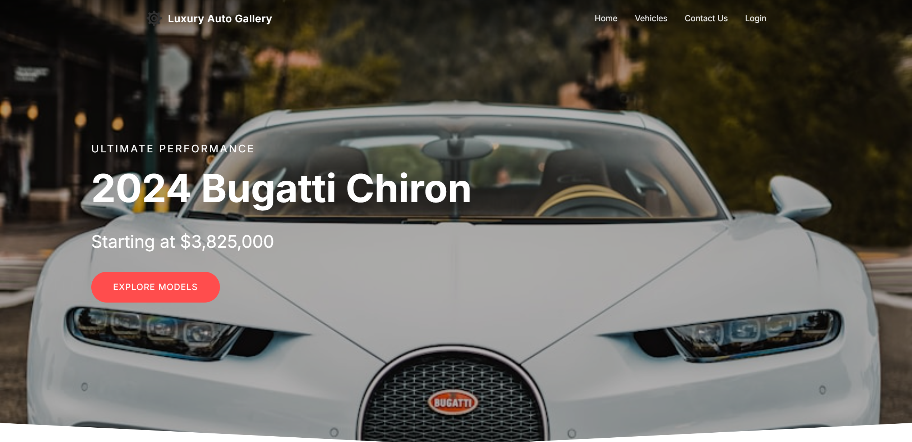
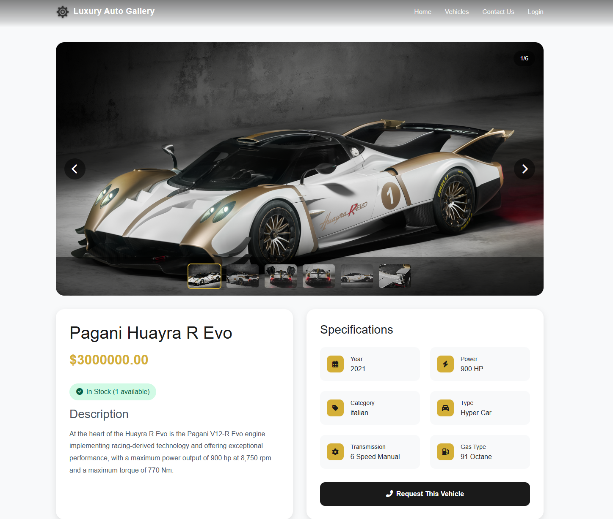
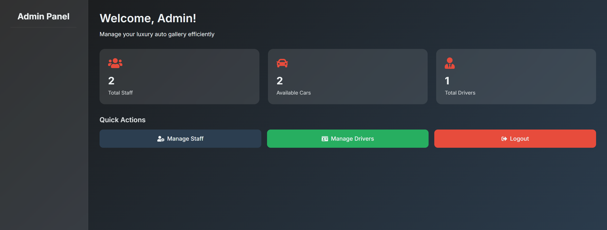
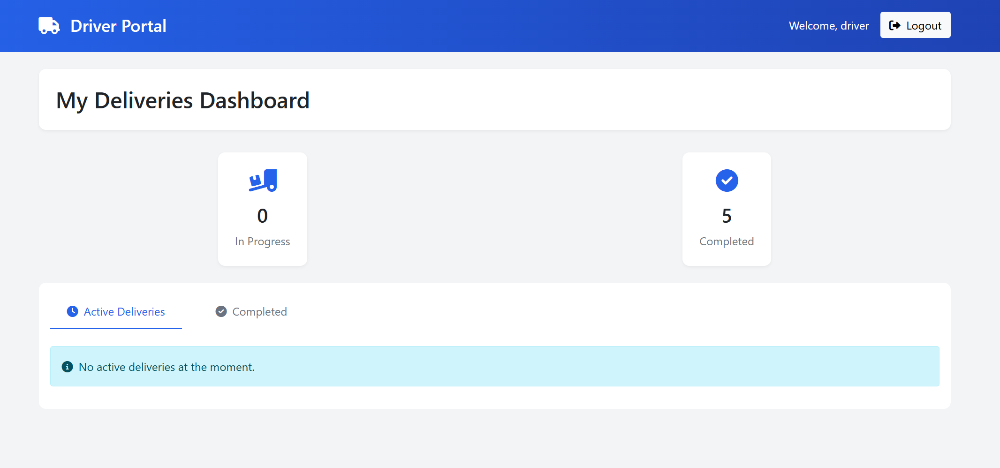
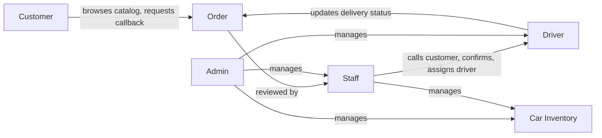
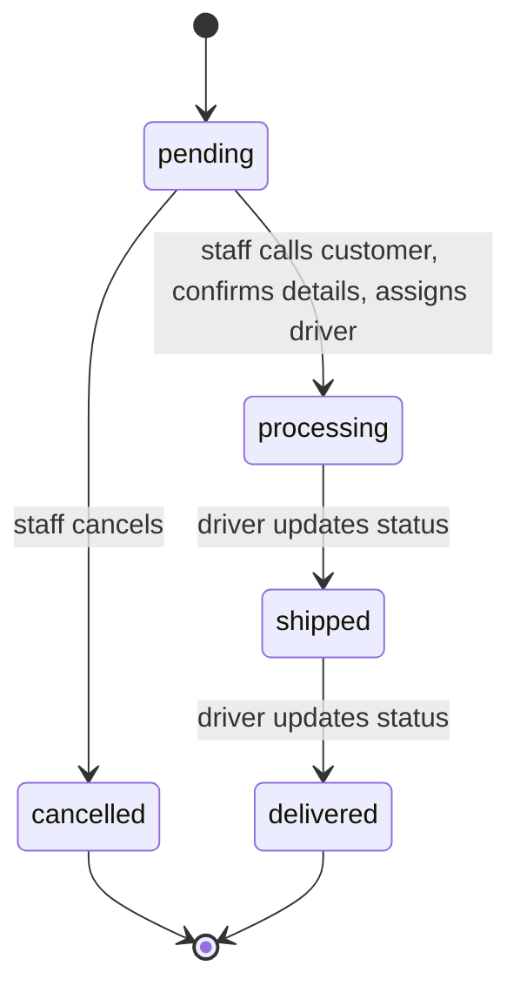

# Car Dealership Management System

A full-stack car dealership management platform built with Django. Supports
role-based dashboards for admins, staff, delivery drivers, and customers, with
vehicle inventory management and an end-to-end order-to-delivery workflow.


## Table of contents

- [Overview](#overview)
- [Screenshots](#screenshots)
- [Features](#features)
- [Architecture](#architecture)
- [Design patterns](#design-patterns)
- [Tech stack](#tech-stack)
- [Getting started](#getting-started)
- [Project structure](#project-structure)
- [Author](#author)

## Overview

This project simulates the day-to-day operations of a car dealership: browsing
vehicles and requesting a callback as a customer, managing inventory and
confirming orders as staff, coordinating deliveries as a driver, and
overseeing the whole operation as an admin — each role gets its own dedicated
dashboard and permissions.

## Screenshots

| Homepage | Car Detail |
|---|---|
|  |  |

| Admin Dashboard | Driver Dashboard |
|---|---|
|  |  |

## Features

- **Role-based accounts** — custom email-based auth with four roles: Admin,
  Staff, Driver, Customer — each with its own dashboard and permissions.
- **Vehicle inventory** — add/edit/delete cars (make, model, category, price,
  stock, transmission, year, etc.) with multiple images per car.
- **Public catalog** — browsable vehicle listing with category filtering and
  detail pages.
- **Staff & driver management** — admins can add, edit, and remove staff and
  delivery drivers.
- **Callback-request flow** — instead of an instant checkout, customers
  request a vehicle and a preferred callback time; a specialist follows up
  to discuss pricing, financing, and delivery — fitting for high-value
  inventory.
- **Order & delivery workflow** — staff confirm the request, enter delivery
  address and payment method, and assign a driver + delivery date; drivers
  update delivery status through the full lifecycle.
- **Contact form** — public inquiries are stored and reviewable by staff.
- **Django admin** — all models are registered for direct data management.

## Architecture

**Roles and responsibilities**



**Order lifecycle**



## Design patterns

- **Singleton** — the custom `UserManager`.
- **Strategy** — order status transitions (`PendingStrategy`,
  `ProcessingStrategy`, `ShippedStrategy`, `DeliveredStrategy`).
- **Observer** — stock decrement and notifications react to order status
  changes (`StockObserver`, `NotificationObserver`).

## Tech stack

- Python / Django
- SQLite (default local database)

## Getting started

```bash
cd myproject
python manage.py migrate
python manage.py createsuperuser
python manage.py runserver
```

`createsuperuser` will also prompt for **Role** — enter `admin` for full access.

Then visit `http://127.0.0.1:8000/` for the site, or `http://127.0.0.1:8000/admin/`
for the Django admin.

### Configuration

By default `DJANGO_SECRET_KEY` falls back to a local-dev-only key baked into
`settings.py`. For any real deployment, set your own:

```bash
export DJANGO_SECRET_KEY="your-own-secret-key"
```

## Project structure

```
myproject/
├── manage.py
└── myproject/
    ├── models.py       # User, Car, Order, CarImage, ContactMessage, etc.
    ├── views.py        # role-based views and order/delivery workflow
    ├── forms.py
    ├── admin.py        # Django admin registration
    ├── backends.py     # custom email-based authentication backend
    ├── settings.py
    ├── urls.py
    ├── templates/
    │   └── partials/   # shared navbar, etc.
    ├── static/
    └── migrations/
```

## Author

**Your Name Here**

[](https://github.com/rrnsz)
[](https://linkedin.com/in/YOUR-LINKEDIN-HANDLE)
[](https://YOUR-PORTFOLIO-URL)
